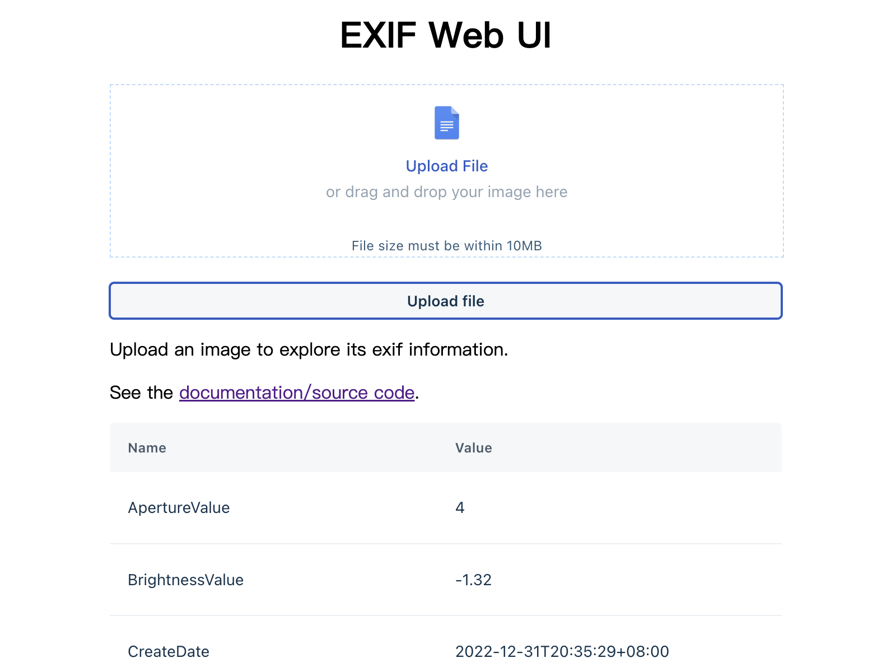

# Exif Web

[](https://github.com/zjc17/exif-web/actions/workflows/github-code-scanning/codeql)
[](https://github.com/zjc17/exif-web/actions/workflows/scan.yaml)
[](https://github.com/zjc17/exif-web/actions/workflows/release.yaml)
[](https://goreportcard.com/report/github.com/zjc17/exif-web)
[](https://hub.docker.com/r/lovecho/exif-web)

[Features](#features)
•
[Download](#download)
•
[Demo](#demo)
•
[Usage](#usage)
•
[Future](#future)
•
[Configuration](#configuration)
•
[Credit](#credit)

<p style="text-align: center;">
  <a href="README.md" target="_blank">ENGLISH</a> | <a href="README_CN.md">中文文档</a>
</p>

Lightweight Opensource Exif Analytic Backend written in Golang, with binary size < 15MB.

Support Restfull API, WebUI, x86, ARM, Linux, macOS.



## Features

- 🏎️ Utilized fastest and wildly used EXIF Javascript [lib](https://github.com/MikeKovarik/exifr).
- 📷 Files: .jpg, .tif, .png, .heic, .avif, .iiq
- 📑 Reads only first few bytes for a given url or image data.
- 🗜️ Easy to deploy: one cross-platform binary file or docker to deploy.
- Lightweight cache / persistent storage by sqlite.

## Download

Download the binaries for your system and architecture from
the [releases page](https://github.com/zjc17/exif-web/releases).

If you use docker, you can use the following command ([Dockerhub](https://hub.docker.com/r/lovecho/exif-web))

```bash
docker pull lovecho/exif-web:latest
```

## Demo

You can also check the live demo here [exif.gotool.tech](https://exif.gotool.tech)

## Usage

Use default parameters launch the api server:

```bash
./exif-web
```

### WebUI Usage

After start `exif-web`, open the webui at [localhost:8080](localhost:8080), then

- upload you local image
- or parse remote image by Restful API

### Restful API Usage

Parse a remote image with its uri

```bash
curl 'http://127.0.0.1:8080/api/v1/parse?url=$IMAGE_URL'
```

### Docker Usage

There is no difference between using parameters in Docker and the above,
for example, we start a Web UI formatting tool service in Docker:

```bash
docker run --rm -it -p 8080:8080 lovecho/exif-web:latest
```

### Docker Compose

You can find the `docker-compose.yml` file at [docker/docker-compose.yml](docker/docker-compose.yml) in project.

Feel free to customise it.

### As an external library

Install dependency

```bash
go get github.com/zjc17/exif-web
```

```golang
package main

import (
	"fmt"
	"github.com/zjc17/exif-web/pkg/fetcher"
	"github.com/zjc17/exif-web/pkg/parser"
)

func main() {
	url := ""
	image, _ := fetcher.GetImagePartial(url, nil)
	p := parser.NewParser()
	result, _ := p.Parse(image)
	fmt.Printf("%+v", result)
}
```

## Future

- [x] Support read image on local filesystem
- [x] A simple web ui as live demo
- [x] A simple built-in k/v caching system to prevent duplication of parsing

## Configuration

Environment variables:

| Name                 | Default                 | Description      |
|----------------------|-------------------------|------------------|
| EXIF_WEB_SQLITE_PATH | `/tmp/exif-web.sqlite3` | sqlite file path |

## Credit

Exif parse components:

- [exifr](https://github.com/MikeKovarik/exifr): The fastest and most versatile JavaScript EXIF reading library,
  under [MIT license]
- modified javascript version for golang execution, under [Apache-2.0 license], 28/04/2023:
    - allow running in golang
    - https://github.com/zjc17/exif-web

Runtime dependent components:

- [goja](https://github.com/dop251/goja): ECMAScript 5.1(+) implementation in Go, under [MIT license].

Web components:

- [Gin](https://github.com/gin-gonic/gin): a HTTP web framework written in Go (Golang), under [MIT license]

WebUI components:

- [Crayons](https://github.com/freshworks/crayons): A UI Kit comprising of web components for building Freshworks
  Apps! - [License not specified yet]
