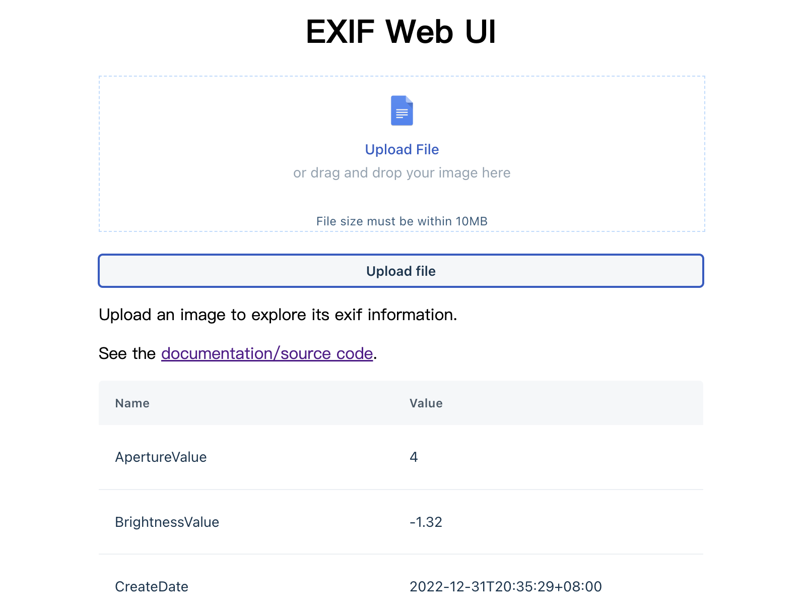

# Exif Web

[](https://github.com/zjc17/exif-web/actions/workflows/github-code-scanning/codeql)
[](https://github.com/zjc17/exif-web/actions/workflows/scan.yaml)
[](https://github.com/zjc17/exif-web/actions/workflows/release.yaml)
[](https://goreportcard.com/report/github.com/zjc17/exif-web)
[](https://hub.docker.com/r/lovecho/exif-web)

[功能](#功能)
•
[下载](#下载)
•
[演示](#演示)
•
[用法](#用法)
•
[未来](#未来)
•
[配置](#配置)
•
[信用](#信用)

<p style="text-align: center;">
  <a href="README.md" target="_blank">ENGLISH</a> | <a href="README_CN.md">中文文档</a>
</p>

用Golang编写的轻量级开源Exif分析后端，二进制文件小于15MB。

支持Restfull API, WebUI, x86, ARM, Linux, macOS。



## 功能

- 🏎️ 利用了最快和最常用的EXIF Javascript [lib](https://github.com/MikeKovarik/exifr)。
- 📷文件：.jpg, .tif, .png, .heic, .avif, .iiq
- 📑 对于给定的网址或图像数据，只读取前几个字节。
- 🗜️ 易于部署：一个跨平台的二进制文件或docker来部署。
- 通过sqlite实现轻量级缓存/持久化存储。

## 下载

从以下网站下载适合你的系统和架构的二进制文件
[发布页](https://github.com/zjc17/exif-web/releases)。

如果你使用docker，你可以使用以下命令([Dockerhub](https://hub.docker.com/r/lovecho/exif-web))

```bash
docker pull lovecho/exif-web:latest
```

## 演示

你也可以在这里查看实时演示 [exif.gotool.tech](https://exif.gotool.tech)

## 用法

使用默认参数启动api服务器：

```bash
./exif-web
```

### 使用 WebUI

启动`exif-web`后，在[localhost:8080](localhost:8080)打开webui，然后

- 上传你的本地图片
- 或通过Restful API解析远程图像

### 使用 Restful API

解析远程图片URI：

```bash
curl 'http://127.0.0.1:8080/api/v1/parse?url=$IMAGE_URL'
```

### 使用 Docker

在Docker中使用参数和上述方法没有区别、
例如，我们在Docker中启动一个Web UI格式化工具服务：

```bash
docker run --rm -it -p 8080:8080 lovecho/exif-web:latest
```

### Docker Compose

你可以在项目中的[docker/docker-compose.yml](docker/docker-compose.yml)找到`docker-compose.yml`文件。

请自由地定制它。

### 作为外部库使用

安装依赖

```bash
go get github.com/zjc17/exif-web
```

```golang
package main

import (
	"fmt"
	"github.com/zjc17/exif-web/pkg/fetcher"
	"github.com/zjc17/exif-web/pkg/parser"
)

func main() {
	url := ""
	image, _ := fetcher.GetImagePartial(url, nil)
	p := parser.NewParser()
	result, _ := p.Parse(image)
	fmt.Printf("%+v", result)
}
```

## 未来

- [x] 支持读取本地文件系统上的图像
- [x] 一个简单的web ui作为现场演示
- [x] 一个简单的内置k/v缓存系统，以防止重复的解析

## 配置

环境变量:

| 名称                   | 默认值                     | 描述          |
|----------------------|-------------------------|-------------|
| EXIF_WEB_SQLITE_PATH | `/tmp/exif-web.sqlite3` | sqlite 文件地址 |

## 信用

Exif解析组件：

- [exifr](https://github.com/MikeKovarik/exifr)： 最快和最通用的JavaScript EXIF读取库、
  在[MIT许可证]下
- 为golang执行而修改的javascript版本，根据[Apache-2.0 license]，28/04/2023：
  - 允许在golang中运行
  - https://github.com/zjc17/exif-web

运行时依赖：

- [goja](https://github.com/dop251/goja)： ECMAScript 5.1(+)在Go中的实现，基于[MIT license]。

网络组件：

- [Gin](https://github.com/gin-gonic/gin): 一个用Go(Golang)编写的HTTP网络框架，根据[MIT license]。

WebUI组件：

- [Crayons](https://github.com/freshworks/crayons)： 一个由Web组件组成的UI工具包，用于构建Freshworks
  应用程序！ [Crayons - [尚未指定许可证] 。
